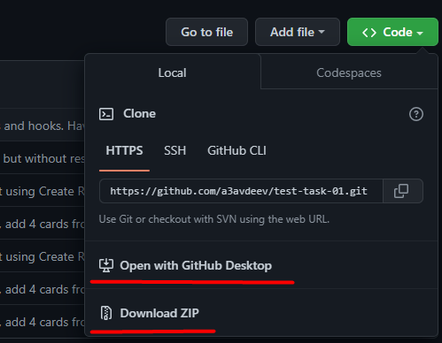

Тестовый проект для GoIT

Вы можете скачать его себе на локальный диск и попробовать модифицировать код

После через терминал установить зависимости, нажать  `npm install`

Запуск приложения через `npm start`

Приложение запустится по адресам http://localhost:3000 http://192.168.1.10:3000
в вашем браузере
